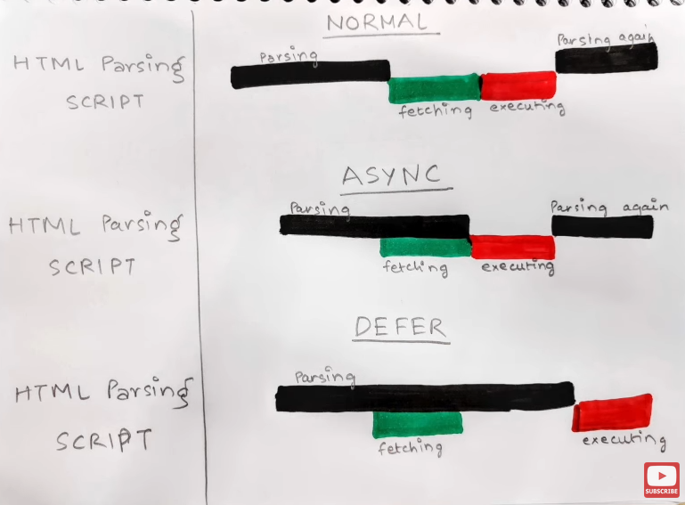

# Assignment 01 - Inception
## 1. What is Emmet ?
Emmet is a plugin for text editors to improve productivity and speed. It provides a set of shortcuts that can be used to generate code.
## 2. Difference between Libary and Framework
- The term library simply refers to a collection of code that is reused repeatedly. It comprises of a list of pre-defined function and classes that can be used to improve simplify tasks. React is a library.
- Framework is a foundation upon which developers build application. It comes with its basic package which includes all the basic files required. We need to follow the structure and rules defined for the respective framework.
## 3. What is CDN ? Why do we use it ?
- A content delivery network (CDN) is a geographically distributed group of servers that caches content close to end users. This reduces load time, security and to reduce our actual server's bandwith usage. CDN sits between hosted server and client hence it can also prevent DDOS attack on our servers.
## 4. Why is React known as React ?
React is called React beacuse the library was designed to react to changes in data and update the ui accordingly.
## 5.  What is cross-origin in script tag ?
Crossorigin in scriipt tag is used to specify browser to support CORS (Cross Origin Resource Sharing) and allow to load script from another server.
## 6. What is difference between React and ReactDOM
React is a JavaScript library for building user interfaces. ReactDOM is a package that serves as the entry point to the DOM and server renderers for React. ReactDOM is responsible for rendering components to the DOM, while React is responsible for managing the state and components.
## 7. What is difference between react.development.js and react.production.js files via CDN ?
The production version will be optimized in a few ways smaller file size by minimizing variable names and removing white space, etc. Whereas the development version will remain readable, might include source maps, etc., making it better for debugging and development usage. Functionally they're the same 
## 8. What are async and defer ?

- Async will help us load the scripts parallely while HTML parsing. Once the script is loaded, parsing will stop and the script is executed. Parsing resumes after execution is completed.

- Defer helps us load the scripts parallely while HTML parsing. Once the parsing is completed the parallely loaded script uis executed.
  
- Async does not guarantee execution of scripts in the order they were fetched but defer does.
